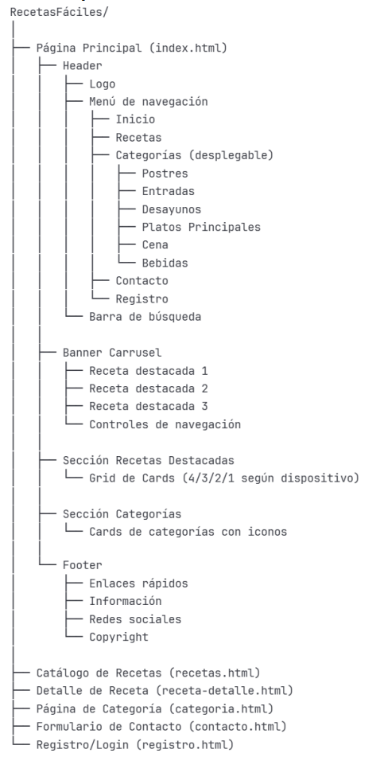
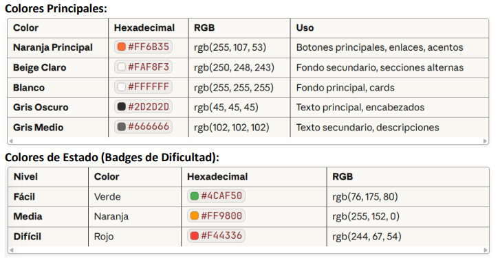

# Arquitectura

[← Volver al índice](index.md)

---

## 🏗️ Estructura del Proyecto

### Arquitectura de Información



```
RecetasFáciles/
│
├── 📄 index.html (Página principal)
│
├── 📁 css/
│   ├── styles.css (Estilos generales)
│   ├── responsive.css (Media queries)
│   └── components.css (Componentes reutilizables)
│
├── 📁 js/
│   ├── main.js (Funcionalidad principal)
│   ├── carousel.js (Banner rotativo)
│   ├── search.js (Búsqueda y filtros)
│   └── categories.js (Menú de categorías)
│
├── 📁 img/
│   ├── 📁 recetas/ (Fotografías de platos)
│   ├── 📁 categorias/ (Iconos de categorías)
│   └── 📁 icons/ (Iconografía general)
│
├── 📁 php/ (Backend - Fase futura)
│   ├── config.php
│   ├── database.php
│   ├── 📁 controllers/
│   └── 📁 models/
│
├── 📁 sql/
│   └── recetas.sql (Estructura de BD)
│
└── 📁 docs/ (Documentación)
```

---

## 💻 Tecnologías Empleadas

### Frontend

#### HTML5 - Estructura Semántica

```html
<!-- Ejemplo de estructura semántica -->
<header>
  <nav>
    <ul>
      <li><a href="#inicio">Inicio</a></li>
      <li><a href="#categorias">Categorías</a></li>
    </ul>
  </nav>
</header>

<main>
  <section class="hero-banner">
    <!-- Banner carrusel -->
  </section>
  
  <section class="recetas-destacadas">
    <article class="recipe-card">
      <!-- Tarjeta de receta -->
    </article>
  </section>
</main>

<footer>
  <!-- Pie de página -->
</footer>
```

**Etiquetas semánticas utilizadas:**
- `<header>` - Cabecera del sitio
- `<nav>` - Navegación
- `<main>` - Contenido principal
- `<section>` - Secciones de contenido
- `<article>` - Contenido independiente (recetas)
- `<footer>` - Pie de página
- `<aside>` - Contenido complementario

---

#### CSS3 - Diseño y Estilos

**Metodología BEM (Block, Element, Modifier):**

```css
/* Block */
.recipe-card { }

/* Element */
.recipe-card__title { }
.recipe-card__image { }
.recipe-card__description { }

/* Modifier */
.recipe-card--featured { }
.recipe-card--easy { }
```

**Variables CSS para Paleta de Colores:**

```css
:root {
  /* Colores Principales */
  --color-primary: #D97526;      /* Naranja oscuro */
  --color-secondary: #F5E6D3;    /* Beige */
  --color-accent: #FFA54F;       /* Naranja claro */
  
  /* Colores Neutros */
  --color-white: #FFFFFF;
  --color-dark: #333333;
  
  /* Estados */
  --color-success: #4CAF50;      /* Verde - Fácil */
  --color-warning: #FFC107;      /* Amarillo - Media */
  --color-danger: #F44336;       /* Rojo - Difícil */
  
  /* Sombras */
  --shadow-light: 0 2px 8px rgba(0,0,0,0.1);
  --shadow-medium: 0 4px 15px rgba(0,0,0,0.15);
}
```

**CSS Grid para Layouts:**

```css
.recipes-grid {
  display: grid;
  grid-template-columns: repeat(4, 1fr);
  gap: 30px;
  padding: 40px;
}

/* Tablet Horizontal */
@media (max-width: 1024px) {
  .recipes-grid {
    grid-template-columns: repeat(3, 1fr);
    gap: 20px;
  }
}

/* Tablet Vertical */
@media (max-width: 768px) {
  .recipes-grid {
    grid-template-columns: repeat(2, 1fr);
    gap: 15px;
  }
}

/* Móvil */
@media (max-width: 667px) {
  .recipes-grid {
    grid-template-columns: 1fr;
    gap: 10px;
  }
}
```

**Flexbox para Componentes:**

```css
.navbar {
  display: flex;
  justify-content: space-between;
  align-items: center;
  padding: 20px 40px;
}

.recipe-card__info {
  display: flex;
  justify-content: space-around;
  align-items: center;
  margin-top: 15px;
}
```

---

#### JavaScript - Interactividad

**Carousel (Banner Rotativo):**

```javascript
// carousel.js
class Carousel {
  constructor(element) {
    this.carousel = element;
    this.slides = element.querySelectorAll('.slide');
    this.currentSlide = 0;
    this.autoplayInterval = null;
    
    this.init();
  }
  
  init() {
    this.showSlide(this.currentSlide);
    this.startAutoplay();
    this.addEventListeners();
  }
  
  showSlide(index) {
    this.slides.forEach(slide => slide.classList.remove('active'));
    this.slides[index].classList.add('active');
  }
  
  nextSlide() {
    this.currentSlide = (this.currentSlide + 1) % this.slides.length;
    this.showSlide(this.currentSlide);
  }
  
  prevSlide() {
    this.currentSlide = (this.currentSlide - 1 + this.slides.length) % this.slides.length;
    this.showSlide(this.currentSlide);
  }
  
  startAutoplay() {
    this.autoplayInterval = setInterval(() => {
      this.nextSlide();
    }, 5000);
  }
}
```

**Búsqueda en Tiempo Real:**

```javascript
// search.js
function searchRecipes() {
  const searchInput = document.getElementById('search-input');
  const searchTerm = searchInput.value.toLowerCase();
  const recipeCards = document.querySelectorAll('.recipe-card');
  
  recipeCards.forEach(card => {
    const title = card.querySelector('.recipe-card__title').textContent.toLowerCase();
    const description = card.querySelector('.recipe-card__description').textContent.toLowerCase();
    
    if (title.includes(searchTerm) || description.includes(searchTerm)) {
      card.style.display = 'block';
    } else {
      card.style.display = 'none';
    }
  });
}

// Event listener
document.getElementById('search-input').addEventListener('keyup', searchRecipes);
```

**Menú Desplegable:**

```javascript
// categories.js
const categoryMenu = document.querySelector('.category-menu');
const categoryDropdown = document.querySelector('.category-dropdown');

categoryMenu.addEventListener('mouseenter', () => {
  categoryDropdown.classList.add('show');
});

categoryMenu.addEventListener('mouseleave', () => {
  categoryDropdown.classList.remove('show');
});
```

---

### Backend (Implementación Futura)

#### PHP - Lógica del Servidor

**Conexión a Base de Datos:**

```php
<?php
// config/database.php
class Database {
    private $host = "localhost";
    private $db_name = "recetas";
    private $username = "root";
    private $password = "";
    public $conn;
    
    public function getConnection() {
        $this->conn = null;
        
        try {
            $this->conn = new PDO(
                "mysql:host=" . $this->host . ";dbname=" . $this->db_name,
                $this->username,
                $this->password
            );
            $this->conn->exec("set names utf8");
        } catch(PDOException $exception) {
            echo "Error de conexión: " . $exception->getMessage();
        }
        
        return $this->conn;
    }
}
?>
```

**Modelo de Receta:**

```php
<?php
// models/Receta.php
class Receta {
    private $conn;
    private $table_name = "recetas";
    
    public $id;
    public $titulo;
    public $descripcion;
    public $tiempo_preparacion;
    public $porciones;
    public $dificultad;
    public $imagen;
    public $id_categoria;
    
    public function __construct($db) {
        $this->conn = $db;
    }
    
    // Obtener todas las recetas
    function read() {
        $query = "SELECT * FROM " . $this->table_name . " ORDER BY fecha_publicacion DESC";
        $stmt = $this->conn->prepare($query);
        $stmt->execute();
        return $stmt;
    }
    
    // Buscar recetas
    function search($keywords) {
        $query = "SELECT * FROM " . $this->table_name . " 
                  WHERE titulo LIKE ? OR descripcion LIKE ?";
        $stmt = $this->conn->prepare($query);
        $keywords = "%{$keywords}%";
        $stmt->bindParam(1, $keywords);
        $stmt->bindParam(2, $keywords);
        $stmt->execute();
        return $stmt;
    }
}
?>
```

---

#### MySQL - Base de Datos

**Diagrama de Relaciones:**

```
┌─────────────┐       ┌──────────────┐       ┌─────────────┐
│  USUARIOS   │       │   RECETAS    │       │ CATEGORIAS  │
├─────────────┤       ├──────────────┤       ├─────────────┤
│ id (PK)     │───┐   │ id (PK)      │   ┌───│ id (PK)     │
│ nombre      │   │   │ titulo       │   │   │ nombre      │
│ email       │   └──→│ id_usuario   │   │   │ descripcion │
│ password    │       │ id_categoria │───┘   │ icono       │
│ rol         │       │ descripcion  │       └─────────────┘
│ fecha_reg   │       │ tiempo_prep  │
└─────────────┘       │ porciones    │
                      │ dificultad   │
                      │ imagen       │
                      └──────────────┘
```

**Tabla de Recetas:**

```sql
CREATE TABLE recetas (
  id INT(11) NOT NULL AUTO_INCREMENT,
  titulo VARCHAR(150) NOT NULL,
  descripcion TEXT,
  tiempo_preparacion INT(11) NOT NULL,
  tiempo_coccion INT(11) DEFAULT 0,
  porciones INT(11) NOT NULL,
  dificultad ENUM('facil','media','dificil') DEFAULT 'facil',
  imagen VARCHAR(255),
  id_categoria INT(11) NOT NULL,
  id_usuario INT(11) NOT NULL,
  fecha_publicacion DATETIME DEFAULT CURRENT_TIMESTAMP,
  PRIMARY KEY (id),
  FOREIGN KEY (id_categoria) REFERENCES categorias(id),
  FOREIGN KEY (id_usuario) REFERENCES usuarios(id)
);
```

---

## 🎨 Guía de Estilo Visual

### Paleta de Colores



| Color | Hex | Uso |
|-------|-----|-----|
| **Naranja Oscuro** | `#D97526` | Botones principales, enlaces |
| **Beige** | `#F5E6D3` | Fondos suaves, cards |
| **Naranja Claro** | `#FFA54F` | Acentos, hover states |
| **Blanco** | `#FFFFFF` | Fondos principales |
| **Gris Oscuro** | `#333333` | Textos principales |
| **Verde** | `#4CAF50` | Dificultad: Fácil |
| **Amarillo** | `#FFC107` | Dificultad: Media |
| **Rojo** | `#F44336` | Dificultad: Difícil |

---

### Tipografía

#### Playfair Display (Títulos)

```css
font-family: 'Playfair Display', serif;
font-weight: 700;
```

**Uso:**
- Títulos principales (H1)
- Nombres de recetas destacadas
- Logotipo

**Características:** Elegante, sofisticada, inspirada en revistas gastronómicas.

---

#### Lato (Cuerpo de texto)

```css
font-family: 'Lato', sans-serif;
font-weight: 400; /* Regular */
font-weight: 700; /* Bold */
```

**Uso:**
- Texto de navegación
- Descripciones
- Ingredientes y pasos
- Botones

**Características:** Moderna, limpia, excelente legibilidad.

---

### Jerarquía Tipográfica

| Elemento | Fuente | Desktop | Móvil | Peso |
|----------|--------|---------|-------|------|
| **H1** | Playfair Display | 48px | 24px | 700 |
| **H2** | Playfair Display | 32px | 22px | 700 |
| **H3** | Lato | 18px | 16px | 700 |
| **Párrafo** | Lato | 16px | 14px | 400 |
| **Botones** | Lato | 16px | 14px | 600 |
| **Nav** | Lato | 16px | 14px | 500 |

---

### Iconografía

**Font Awesome 6 Free:**

| Elemento | Icono | Código |
|----------|-------|--------|
| Tiempo | ⏱️ | `<i class="fa-regular fa-clock"></i>` |
| Porciones | 👤 | `<i class="fa-solid fa-user"></i>` |
| Dificultad | ⭐ | `<i class="fa-solid fa-star"></i>` |
| Búsqueda | 🔍 | `<i class="fa-solid fa-magnifying-glass"></i>` |
| Menú | ☰ | `<i class="fa-solid fa-bars"></i>` |
| Postres | 🍰 | `<i class="fa-solid fa-cake-candles"></i>` |
| Platos | 🍝 | `<i class="fa-solid fa-bowl-food"></i>` |
| Bebidas | 🥤 | `<i class="fa-solid fa-glass-water"></i>` |

---

### Componentes UI

#### Botones

**Botón Principal:**
```css
.btn-primary {
  background-color: var(--color-primary);
  color: white;
  padding: 15px 40px;
  border-radius: 25px;
  border: none;
  font-weight: 600;
  transition: all 0.3s ease;
}

.btn-primary:hover {
  transform: scale(1.05);
  box-shadow: 0 6px 20px rgba(217, 117, 38, 0.4);
}
```

**Botón Secundario:**
```css
.btn-secondary {
  background-color: transparent;
  color: var(--color-primary);
  border: 2px solid var(--color-primary);
  padding: 13px 38px;
  border-radius: 25px;
}

.btn-secondary:hover {
  background-color: var(--color-primary);
  color: white;
}
```

---

#### Cards de Receta

```css
.recipe-card {
  background: white;
  border-radius: 15px;
  box-shadow: 0 4px 15px rgba(0,0,0,0.1);
  overflow: hidden;
  transition: transform 0.3s ease;
}

.recipe-card:hover {
  transform: translateY(-10px);
  box-shadow: 0 8px 25px rgba(0,0,0,0.15);
}
```

---

## 📐 Responsive Design

### Breakpoints

| Dispositivo | Ancho | Columnas | Menú |
|-------------|-------|----------|------|
| **Móvil** | 320px - 667px | 1 | Hamburguesa |
| **Tablet V** | 668px - 1023px | 2 | Hamburguesa |
| **Tablet H** | 1024px - 1199px | 3 | Hamburguesa |
| **Desktop** | 1200px+ | 4 | Horizontal |


---

## 🔄 Control de Versiones

**Git + GitHub:**

```bash
# Flujo de trabajo básico
git add .
git commit -m "feat: añadir búsqueda por categoría"
git push origin main

# Crear rama para nueva funcionalidad
git checkout -b feature/user-favorites
git push origin feature/user-favorites
```

**Convención de commits:**
- `feat:` Nueva funcionalidad
- `fix:` Corrección de errores
- `docs:` Documentación
- `style:` Cambios de estilo
- `refactor:` Refactorización

---

[← Anterior: Uso](uso.md) | [Siguiente: Conclusiones →](conclusiones.md)
