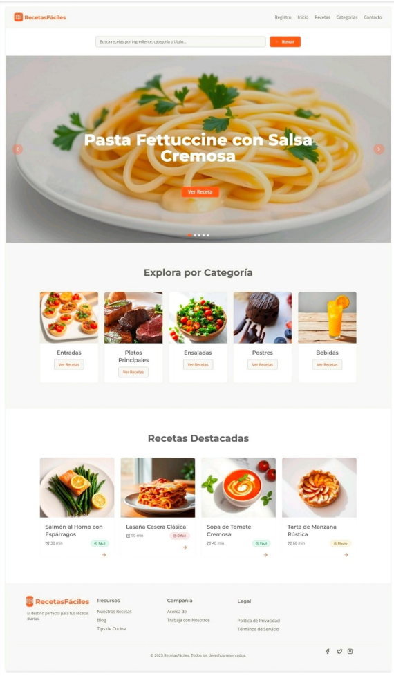

# Introducción

[← Volver al índice](index.md)

---

## 🎯 Objetivo del Proyecto

**RecetasFáciles** es una aplicación web diseñada para compartir y descubrir recetas de cocina y repostería de forma visual, intuitiva y organizada. Su objetivo principal es proporcionar a los usuarios una plataforma atractiva donde puedan explorar recetas clasificadas por categorías, dificultad y tiempo de preparación.

## 🔍 Problema que Resuelve

En la actualidad, muchas personas buscan inspiración culinaria en internet, pero se encuentran con:

- **Información desorganizada** y dispersa en múltiples sitios
- **Interfaces poco intuitivas** que dificultan la búsqueda
- **Falta de categorización clara** de las recetas
- **Diseños no adaptados** a dispositivos móviles

RecetasFáciles soluciona estos problemas ofreciendo:

✅ Un catálogo organizado y fácil de navegar  
✅ Búsqueda avanzada con múltiples filtros  
✅ Interfaz visual atractiva y apetitosa  
✅ Diseño 100% responsive para todos los dispositivos

## 🎨 Funcionalidades Principales

### Para Visitantes (No registrados)

- **Exploración de recetas:** Navegar por el catálogo completo organizado por categorías
- **Búsqueda avanzada:** Filtrar recetas por título, descripción o categoría
- **Visualización detallada:** Ver información completa de cada receta (ingredientes, pasos, tiempo, dificultad)
- **Banner carrusel:** Acceder a las recetas más populares o recientes
- **Sistema de categorías:** Navegar por categorías específicas desde el menú

### Para Usuarios Registrados (Implementación futura)

- Todas las funcionalidades de visitante, más:
- Guardar recetas como favoritas
- Comentar y valorar recetas
- Subir recetas propias con fotografías
- Gestionar perfil personal
- Crear listas personalizadas

### Para Administradores

- Gestión completa del sistema (CRUD):
  - Crear, editar y eliminar recetas
  - Administrar usuarios registrados
  - Gestionar categorías
  - Controlar contenido del banner carrusel
  - Moderar comentarios

## 📂 Categorías Disponibles

El proyecto organiza las recetas en **6 categorías principales:**

| Categoría | Icono | Ejemplos |
|-----------|-------|----------|
| **Postres** | 🍰 | Brownies, tartas, galletas, flan |
| **Entradas** | 🥗 | Ensaladas, guacamole, bruschetta |
| **Desayunos** | 🥞 | Pancakes, tostadas francesas, bowls |
| **Platos Principales** | 🍝 | Pasta, pollo, salmón, lasaña |
| **Cena** | 🍲 | Sopas, quesadillas, wraps |
| **Bebidas** | 🥤 | Smoothies, limonadas, chocolate caliente |

## 🎓 Contexto Académico

Este proyecto se desarrolla como **Proyecto Intermodular** para el CFGS de Desarrollo de Aplicaciones Web, integrando conocimientos de múltiples módulos:

- **Desarrollo Web en Entorno Cliente:** HTML5, CSS3, JavaScript
- **Desarrollo Web en Entorno Servidor:** PHP, MySQL (fase futura)
- **Diseño de Interfaces Web:** UX/UI, responsive design
- **Despliegue de Aplicaciones Web:** Git, GitHub, hosting

---

## 📸 Vista Previa

*Vista principal de RecetasFáciles en escritorio*

---

[Siguiente: Instalación →](instalacion.md)
