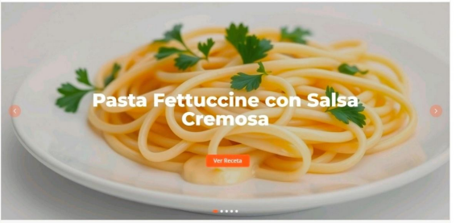

# Uso

[← Volver al índice](index.md)

---

## 👥 Perfiles de Usuario

RecetasFáciles está diseñada para tres tipos de usuarios con diferentes niveles de acceso:

### 🌐 Visitante (No registrado)

**Permisos:**
- ✅ Explorar todas las recetas disponibles
- ✅ Utilizar la barra de búsqueda
- ✅ Navegar por categorías
- ✅ Visualizar detalles completos de recetas
- ❌ Guardar favoritos
- ❌ Comentar o valorar
- ❌ Subir recetas propias

**Ideal para:** Usuarios que buscan recetas ocasionalmente sin necesidad de personalización.

---

### 👤 Usuario Registrado (Funcionalidad futura)

**Permisos:**
- ✅ Todas las funcionalidades del visitante
- ✅ Guardar recetas como favoritas
- ✅ Comentar y valorar recetas
- ✅ Subir recetas propias con fotografías
- ✅ Gestionar perfil personal
- ✅ Crear listas personalizadas

**Ideal para:** Usuarios frecuentes que desean personalizar su experiencia y compartir contenido.

---

### 🔐 Administrador

**Permisos:**
- ✅ Acceso completo al sistema (CRUD)
- ✅ Gestionar recetas (crear, editar, eliminar, publicar/despublicar)
- ✅ Administrar usuarios registrados
- ✅ Gestionar categorías
- ✅ Controlar contenido del banner carrusel
- ✅ Moderar comentarios

**Ideal para:** Gestión y mantenimiento de la plataforma.

---

## 📱 Guía de Usuario

### Navegación Principal


La barra de navegación incluye:

1. **Logo RecetasFáciles:** Clic para volver al inicio
2. **Inicio:** Página principal con recetas destacadas
3. **Categorías:** Menú desplegable con 6 categorías
4. **Registro:** Crear cuenta de usuario (próximamente)
5. **Barra de Búsqueda:** Buscar recetas por título o descripción

---

### 🔍 Búsqueda de Recetas

#### Búsqueda Simple

1. Escribir el nombre de la receta en la barra de búsqueda
2. Los resultados se filtran en tiempo real
3. Hacer clic en la receta deseada

**Ejemplo:**
```
Buscar: "chocolate" 
Resultados: Brownie de Chocolate, Chocolate Caliente
```

#### Búsqueda por Categoría

1. Hacer clic en **"Categorías"** en el menú
2. Seleccionar una categoría:
   - 🍰 Postres
   - 🥗 Entradas
   - 🥞 Desayunos
   - 🍝 Platos Principales
   - 🍲 Cena
   - 🥤 Bebidas
3. Ver todas las recetas de esa categoría

---

### 🎠 Banner Carrusel

El banner carrusel muestra recetas destacadas con rotación automática:

**Características:**
- Rotación automática cada 5 segundos
- Botones de navegación (anterior/siguiente)
- Indicadores de posición (puntos)
- Pausa automática al pasar el mouse

**Interacción:**
1. **Ver receta:** Clic en el botón "Ver Receta"
2. **Navegar:** Usar flechas izquierda/derecha
3. **Saltar:** Clic en los puntos indicadores



---

### 📋 Visualización de Recetas

Cada tarjeta de receta muestra:

| Elemento | Descripción |
|----------|-------------|
| **Imagen** | Fotografía del plato terminado |
| **Título** | Nombre de la receta |
| **⏱️ Tiempo** | Tiempo total de preparación |
| **👤 Porciones** | Número de personas |
| **⭐ Dificultad** | Fácil / Media / Difícil |
| **Botón** | "Ver Receta" para más detalles |

**Códigos de Dificultad:**

```css
🟢 Verde  → Fácil
🟡 Amarillo → Media
🔴 Rojo   → Difícil
```


---

### 📖 Detalle de Receta

Al hacer clic en "Ver Receta", se muestra:

1. **Imagen grande** del plato
2. **Título y descripción**
3. **Información nutricional:**
   - Tiempo de preparación
   - Tiempo de cocción
   - Número de porciones
   - Nivel de dificultad
4. **Lista de ingredientes** con cantidades exactas
5. **Pasos de preparación** numerados y detallados
6. **Consejos y trucos** (opcional)

---

## 💡 Casos de Uso

### Caso 1: Usuario Busca Inspiración para el Desayuno

**Escenario:** María quiere preparar algo especial para el desayuno del domingo.

**Pasos:**
1. Accede a RecetasFáciles
2. Hace clic en **Categorías → Desayunos**
3. Ve opciones: Pancakes, Tostadas Francesas, Bowl de Açaí
4. Selecciona "Pancakes Esponjosos"
5. Lee ingredientes y pasos
6. Comienza a cocinar

**Resultado:** Desayuno delicioso en 20 minutos ✅

---

### Caso 2: Usuario Busca Receta Rápida para la Cena

**Escenario:** Carlos llega tarde del trabajo y necesita cocinar rápido.

**Pasos:**
1. Accede a RecetasFáciles
2. Usa la barra de búsqueda: "rápido"
3. Filtra por categoría "Cena"
4. Encuentra: Quesadillas (20 min), Wraps (15 min)
5. Elige "Wraps Vegetarianos"
6. Cocina siguiendo los pasos

**Resultado:** Cena lista en 15 minutos ✅

---

### Caso 3: Usuario Quiere Sorprender con un Postre

**Escenario:** Ana quiere preparar un postre para una cena con amigos.

**Pasos:**
1. Accede a RecetasFáciles
2. Navega al banner carrusel
3. Ve "Brownie de Chocolate Fudge" destacado
4. Hace clic en "Ver Receta"
5. Verifica: 40 min, 12 porciones, Fácil
6. Guarda como favorita (si está registrada)
7. Prepara el brownie

**Resultado:** Éxito garantizado en la cena ✅

---

### Caso 4: Administrador Añade Nueva Receta

**Escenario:** El administrador recibe una receta de un usuario y la quiere publicar.

**Pasos (Backend - Fase futura):**
1. Accede al panel de administración
2. Clic en "Nueva Receta"
3. Completa el formulario:
   - Título: "Tarta de Limón"
   - Categoría: Postres
   - Tiempo: 45 minutos
   - Dificultad: Media
   - Ingredientes y pasos
4. Sube fotografía (máx. 200KB)
5. Publica la receta

**Resultado:** Nueva receta visible para todos ✅

---

## 🎯 Buenas Prácticas

### Para Visitantes

✅ Usar filtros para encontrar recetas más rápido  
✅ Leer toda la receta antes de comenzar  
✅ Preparar todos los ingredientes previamente  
✅ Seguir los pasos en orden  

### Para Usuarios Registrados (Futuro)

✅ Crear listas temáticas (ej: "Recetas rápidas", "Postres favoritos")  
✅ Comentar con consejos útiles  
✅ Subir fotografías de calidad  
✅ Valorar recetas de forma constructiva  

### Para Administradores

✅ Revisar recetas antes de publicar  
✅ Moderar comentarios inapropiados  
✅ Mantener categorías organizadas  
✅ Actualizar el banner con contenido relevante  

---

## 📊 Estadísticas de Uso (Ejemplo)

| Métrica | Valor |
|---------|-------|
| Recetas disponibles | 50+ |
| Categorías activas | 6 |
| Usuarios registrados | 150+ |
| Recetas más vistas | Brownie de Chocolate |
| Categoría más popular | Postres |

---

## 🆘 Soporte

¿Problemas o dudas?

- 📧 Email: soporte@recetasfaciles.com
- 💬 Chat en vivo: Disponible L-V 9:00-18:00
- 📖 FAQ: [Preguntas frecuentes](#)

---

[← Anterior: Instalación](instalacion.md) | [Siguiente: Arquitectura →](arquitectura.md)
